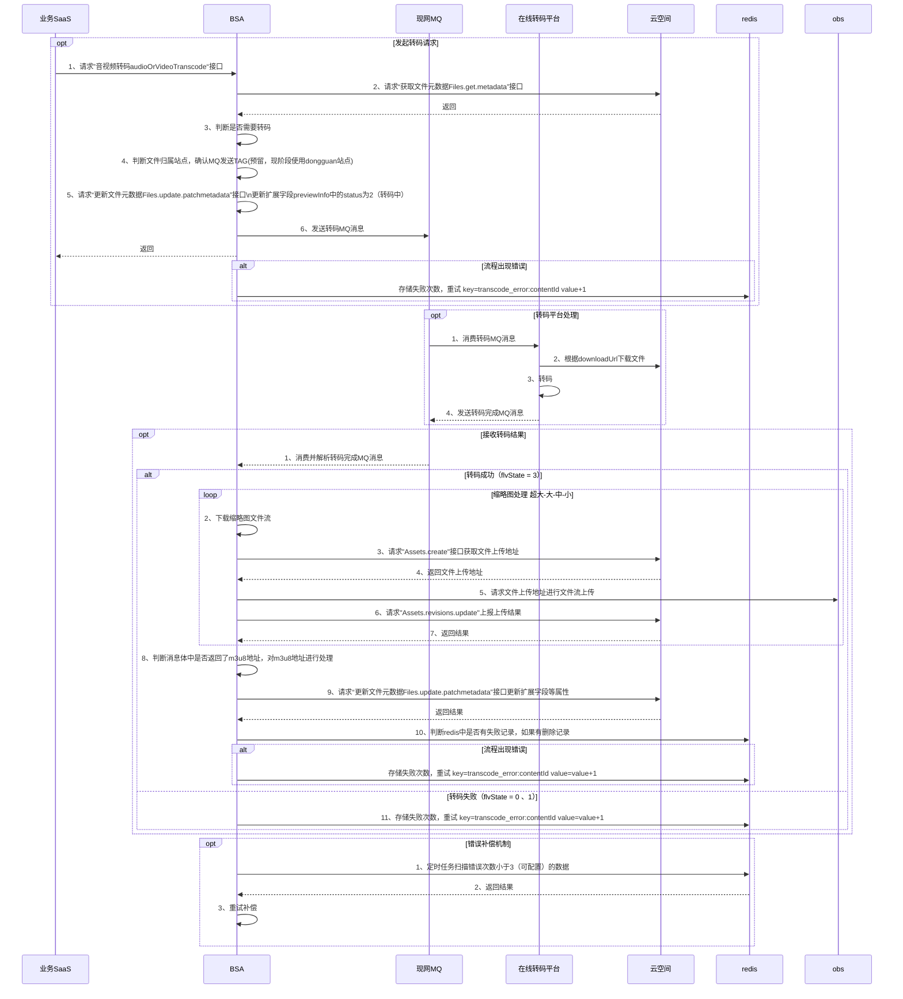
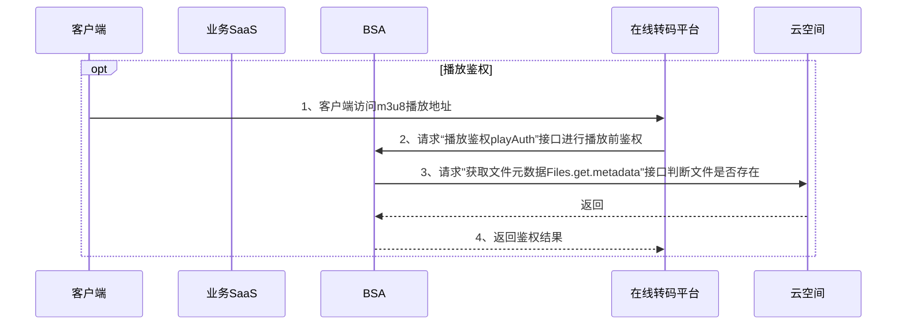
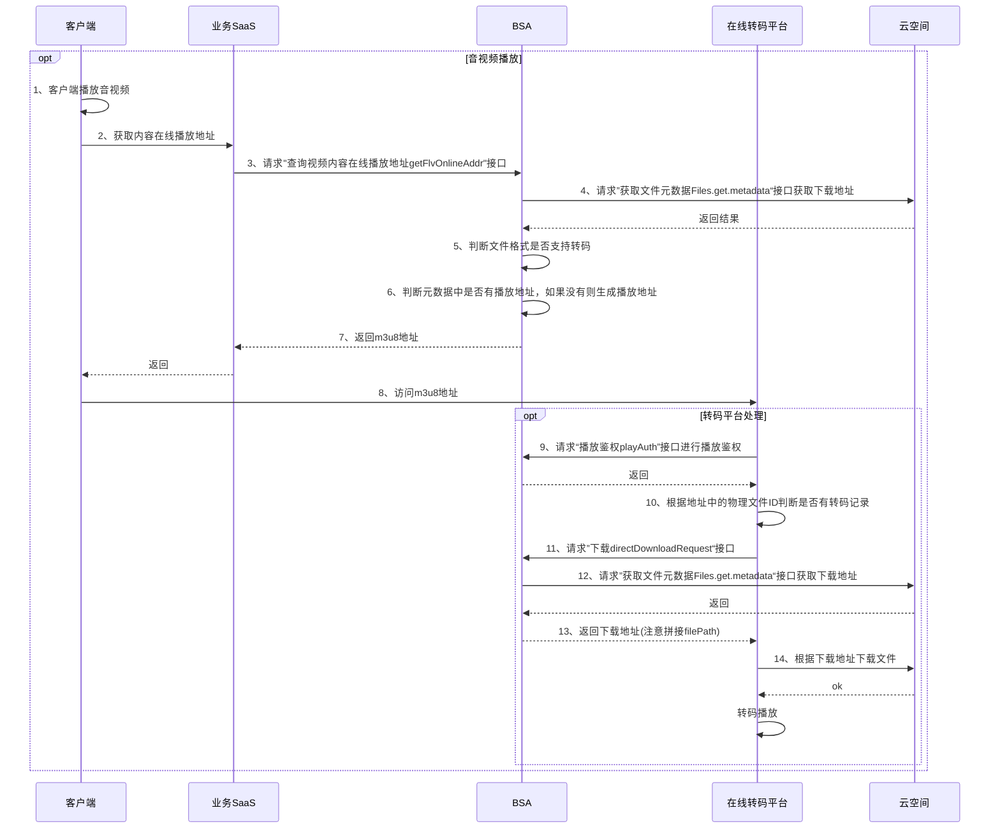
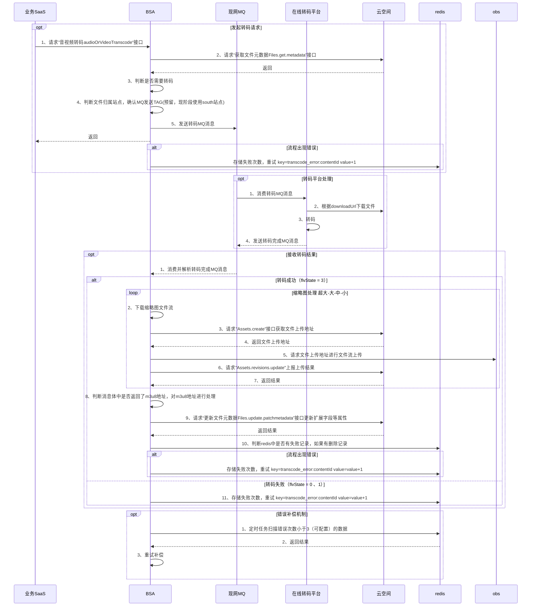

## 音视频转码

```mermaid
sequenceDiagram

participant saas as 业务SaaS
participant fg as BSA
participant mq as 现网MQ
participant zm as 在线转码平台
participant cloud as 云空间
participant redis as redis

opt 发起转码请求 
	saas ->> fg: 1、请求”音视频转码audioOrVideoTranscode“接口
    fg ->> cloud: 2、请求“获取文件元数据Files.get.metadata”接口
    cloud -->> fg: 返回
    fg ->> fg: 3、判断是否需要转码
    fg ->> fg: 4、判断文件归属站点，确认MQ发送TAG(预留，现阶段使用dongguan站点)
    fg ->> fg: 5、请求“更新文件元数据Files.update.patchmetadata”接口\n更新扩展字段previewInfo中的status为2（转码中）
    fg ->> mq: 6、发送转码MQ消息
    fg -->> saas: 返回
    alt 流程出现错误
    	fg ->> redis: 存储失败次数，重试 key=transcode_error:contentId value+1
    end
end

opt 转码平台处理
    mq ->> zm: 1、消费转码MQ消息
    zm ->> cloud: 2、根据downloadUrl下载文件
    zm ->> zm: 3、转码
    zm -->> mq: 4、发送转码完成MQ消息
end

opt 接收转码结果
mq -->> fg: 1、消费并解析转码完成MQ消息
	alt 转码成功（flvState = 3）
        loop 缩略图处理 超大-大-中-小
            fg ->> fg: 2、下载缩略图文件流
            fg ->> cloud: 3、请求"Assets.create"接口获取文件上传地址
            cloud -->> fg: 4、返回文件上传地址
            fg ->> obs: 5、请求文件上传地址进行文件流上传
            fg ->> cloud: 6、请求"Assets.revisions.update"上报上传结果
            cloud -->> fg: 7、返回结果
		end
		fg ->> fg: 8、判断消息体中是否返回了m3u8地址，对m3u8地址进行处理
		fg ->> cloud: 9、请求“更新文件元数据Files.update.patchmetadata”接口更新扩展字段等属性
		cloud -->> fg: 返回结果
		fg ->> redis: 10、判断redis中是否有失败记录，如果有删除记录
		alt 流程出现错误
			fg ->> redis: 存储失败次数，重试 key=transcode_error:contentId value=value+1
		end
	else 转码失败（flvState = 0 、1）
		fg ->> redis: 11、存储失败次数，重试 key=transcode_error:contentId value=value+1
	end
end

opt 错误补偿机制
    fg ->> redis:1、定时任务扫描错误次数小于3（可配置）的数据
    redis -->> fg:2、返回结果
    fg ->> fg: 3、重试补偿
end
```

## 音视频播放鉴权

```mermaid
sequenceDiagram

participant client as 客户端
participant saas as 业务SaaS
participant fg as BSA
participant zm as 在线转码平台
participant cloud as 云空间
opt 播放鉴权 
    client ->> zm: 1、客户端访问m3u8播放地址
    zm ->> fg: 2、请求“播放鉴权playAuth”接口进行播放前鉴权
    fg ->> cloud: 3、请求"获取文件元数据Files.get.metadata"接口判断文件是否存在
    cloud -->> fg: 返回
    fg -->> zm: 4、返回鉴权结果
end
```

## 音视频播放

```mermaid
sequenceDiagram

participant client as 客户端
participant saas as 业务SaaS
participant fg as BSA
participant zm as 在线转码平台
participant cloud as 云空间

opt 音视频播放 
    client ->> client: 1、客户端播放音视频
    client ->> saas: 2、获取内容在线播放地址
    saas ->> fg: 3、请求"查询视频内容在线播放地址getFlvOnlineAddr"接口
    fg ->> cloud: 4、请求”获取文件元数据Files.get.metadata“接口获取下载地址
    cloud -->> fg: 返回结果
    fg ->> fg: 5、判断文件格式是否支持转码
    fg ->> fg: 6、判断元数据中是否有播放地址，如果没有则生成播放地址
    fg -->> saas: 7、返回m3u8地址
    saas -->> client: 返回
    client ->> zm: 8、访问m3u8地址
    opt 转码平台处理
        zm ->> fg: 9、请求“播放鉴权playAuth”接口进行播放鉴权 
        fg -->> zm: 返回
        zm ->> zm: 10、根据地址中的物理文件ID判断是否有转码记录 
        zm ->> fg: 11、请求”下载directDownloadRequest“接口
        fg ->> cloud: 12、请求”获取文件元数据Files.get.metadata“接口获取下载地址
        cloud -->> fg: 返回
        fg -->> zm: 13、返回下载地址(注意拼接filePath)
        zm ->> cloud: 14、根据下载地址下载文件
        cloud -->> zm: ok
        zm ->> zm:转码播放
	end
end
```

## 音视频转码字段存储优化

```mermaid
sequenceDiagram

participant saas as 业务SaaS
participant fg as BSA
participant mq as 现网MQ
participant zm as 在线转码平台
participant cloud as 云空间
participant redis as redis

opt 发起转码请求
    saas ->> fg: 1、请求”音视频转码audioOrVideoTranscode“接口
    fg ->> cloud: 2、请求“获取文件元数据Files.get.metadata”接口
    cloud -->> fg: 返回
    fg ->> fg: 3、判断是否需要转码
    fg ->> fg: 4、判断文件归属站点，确认MQ发送TAG(预留，现阶段使用south站点)
    fg ->> mq: 5、发送转码MQ消息
    fg -->> saas: 返回
    alt 流程出现错误
    	fg ->> redis: 存储失败次数，重试 key=transcode_error:contentId value+1
    end
end
opt 转码平台处理
    mq ->> zm: 1、消费转码MQ消息
    zm ->> cloud: 2、根据downloadUrl下载文件
    zm ->> zm: 3、转码
    zm -->> mq: 4、发送转码完成MQ消息
end
opt 接收转码结果
    mq -->> fg: 1、消费并解析转码完成MQ消息
    alt 转码成功（flvState = 3）
        loop 缩略图处理 超大-大-中-小
            fg ->> fg: 2、下载缩略图文件流
            fg ->> cloud: 3、请求"Assets.create"接口获取文件上传地址
            cloud -->> fg: 4、返回文件上传地址
            fg ->> obs: 5、请求文件上传地址进行文件流上传
            fg ->> cloud: 6、请求"Assets.revisions.update"上报上传结果
            cloud -->> fg: 7、返回结果
		end
        fg ->> fg: 8、判断消息体中是否返回了m3u8地址，对m3u8地址进行处理
        fg ->> cloud: 9、请求“更新文件元数据Files.update.patchmetadata”接口更新扩展字段等属性
        cloud -->> fg: 返回结果
		fg ->> redis: 10、判断redis中是否有失败记录，如果有删除记录
		alt 流程出现错误
       		fg ->> redis: 存储失败次数，重试 key=transcode_error:contentId value=value+1
        end
	else 转码失败（flvState = 0 、1）
		fg ->> redis: 11、存储失败次数，重试 key=transcode_error:contentId value=value+1
	end
end
opt 错误补偿机制
    fg ->> redis:1、定时任务扫描错误次数小于3（可配置）的数据
    redis -->> fg:2、返回结果
    fg ->> fg: 3、重试补偿
end
```

